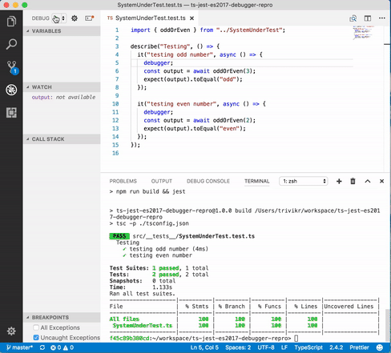

# ts-jest-es2017-debugger-repro
Repro repo for debugger issue with TS target es2017 and ts-jest@20.0.x

Steps to reproduce:
* ```yarn``` or ```npm install``` to install dependencies
* ```npm run test``` to build and run tests, notice that coverage is 100%
* Open the project in VSCode, go to Debug and run "Debug Tests"
* Notice that the build task runs and debugger stops one line after **debugger;** statement as shown in the screen recording below


